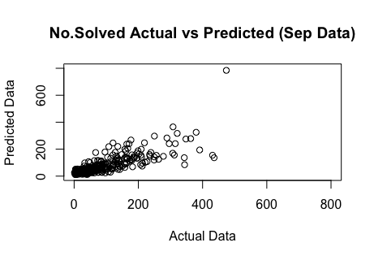
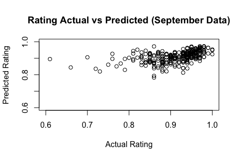
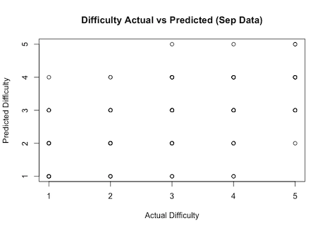

# Quantitative Analysis of Sudoku Variant Puzzles

## Overview

This project analyzes publicly available Sudoku variant puzzle data from [Logic Masters Deutschland (LMD)](https://logic-masters.de), a German organization focused on logic puzzle competitions and puzzle development.

The research investigates how puzzle characteristics, author activity, difficulty ratings, and puzzle variants influence puzzle engagement and solving behavior within the Sudoku community using statistical and predictive modeling techniques in R.

The primary analysis focuses on puzzle data published between January 2023 and August 2023 to capture recent community trends and interactions. Developed regression models were subsequently applied to September 2023 puzzle data to evaluate predictive performance and compare actual versus predicted puzzle outcomes.

---

## Objectives

- Analyze factors influencing Sudoku puzzle popularity and community engagement.
- Examine relationships between puzzle difficulty, puzzle ratings, and solving activity.
- Evaluate the impact of Sudoku variant features on puzzle-solving behavior.
- Develop regression models to predict puzzle solve counts, ratings, and difficulty outcomes.
- Apply developed models to September 2023 puzzle data for predictive validation.
- Identify measurable indicators associated with puzzle success and player satisfaction.

---

## Dataset

The dataset was collected from publicly available records on Logic Masters Deutschland (LMD) and includes:

- Puzzle names
- Author information
- Publication dates
- Number of solved puzzles
- Earliest solved dates
- Difficulty ratings
- Puzzle observations and comments
- Puzzle satisfaction ratings
- Presence of puzzle variants:
  - Killer Sudoku
  - Arrow Sudoku
  - Thermo Sudoku
  - German Whispers
  - Reban
  - Kropki Pairs

---

## Tools & Technologies

- R
- R Studio

---

## Analysis Type

- Descriptive Analysis
- Predictive Analysis
- Regression Analysis

---

## Methodology

The project applied multiple regression analysis techniques to evaluate relationships between puzzle characteristics and player engagement metrics.

Independent variables included:
- Puzzle difficulty
- Variant type
- Publication timing
- Author activity metrics
- Puzzle observations and comments

Dependent variables included:
- Number of solved puzzles
- Puzzle difficulty ratings
- Puzzle satisfaction ratings

---

## Key Findings

- Certain Sudoku variants demonstrated stronger engagement levels than others
- Puzzle difficulty significantly influenced solving activity
- Author publishing activity showed measurable relationships with puzzle popularity
- Regression models provided predictive insight into puzzle performance and community engagement

---

## Predictive Validation

Developed regression models were applied to a subsequent monthly dataset to evaluate predictive performance.

### No. Solved Actual vs Predicted


### Rating Actual vs Predicted


### Difficulty Actual vs Predicted


---

## Repository Structure

```plaintext
├── data/
│   ├── sudoku_dataset.csv
│   └── september_validation_dataset.csv
│
├── scripts/
│   ├── models_development.R
│   └── prediction_graphs.R
│
├── prediction_images/
│   ├── no_solved_prediction.png
│   ├── rating_prediction.png
│   └── difficulty_prediction.png
│
├── Poster.pdf
│
└── README.md
```

---

## Notes

This project was conducted for research purposes using publicly available puzzle data from [Logic Masters Deutschland (LMD)](https://logic-masters.de).
